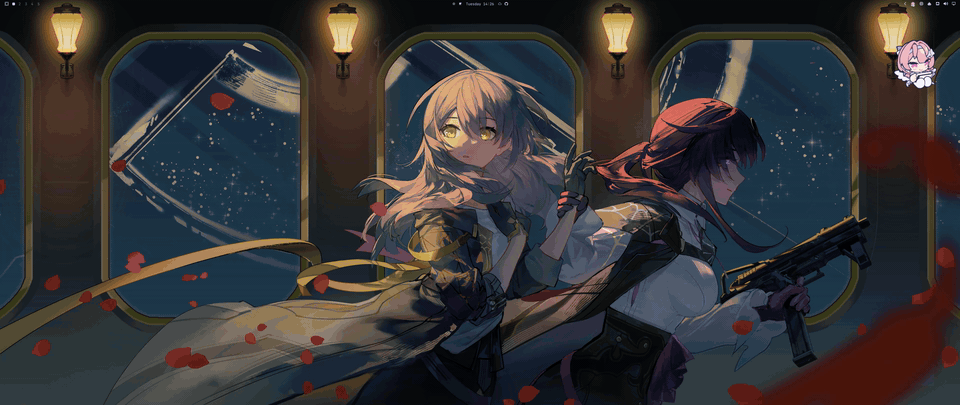

# Omarchy Pets

A desktop pet for the [Omarchy](https://omarchy.org) bar. It plays
[Codex Pets](https://codex-pets.net) sprite sheets from
`~/.omarchy-pets/pets/`, moves on its own every 8–20 seconds, turns its head toward
your pointer, waves when clicked, and can be pinned to the desktop and dragged
anywhere on the screen.



## Requirements

- Omarchy 4 (Quattro) with its Quickshell bar, `omarchy-shell`, on Hyprland.
- `python3`, which every Omarchy install already has (the base packages
  `uwsm`, `ufw` and `udiskie` depend on it). It checks each pet's `pet.json`
  and sprite sheet when the panel opens.
- Pets live in `~/.omarchy-pets/pets/<id>/`. The plugin bundles the
  `omarchy-pets` command line (`cli/`, the same source as
  <https://omarchy-pets.com/cli>) and, on its first load with no pets, puts
  it at `~/.local/bin/omarchy-pets` and installs the pet `guga` from
  omarchy-pets.com. `omarchy-pets install <id>` adds more; the command's
  first run in a terminal offers to copy the pets of `~/.codex/pets/` over
  without touching them.

## Install

```sh
omarchy plugin add https://github.com/ZacharyZhang-NY/omarchy-pets.git --enable
```

On the first load the plugin installs the command line and `guga` (see
"What it touches"), and the pet appears on the desktop. The bar shows the
current pet's first frame; with no pets it shows a paw.

## Use

- Click the pet in the bar to open the panel: the animated pet, the first
  three installed pets, and the settings. Escape or a click outside closes it.
- Click a pet in the list to switch. The choice survives shell restarts. With
  more than three pets, "View all" opens the full list; "Back" returns.
- "Open omarchy-pets.com" opens the pet library in your browser; every pet
  there shows its `omarchy-pets install <id>` command.
- Hover the pet and it looks at the pointer (v2 sheets only); click it and it
  waves.
- "Show on desktop" (on by default) keeps the pet on the desktop while the
  panel is closed; opening the panel brings it into the panel and closing the
  panel puts it back. It never takes keyboard focus and only the pet itself is
  clickable. Drag the pet on the desktop to put it anywhere on the screen; the
  spot is remembered.

## Settings

All of them live in the widget's entry in `~/.config/omarchy/shell.json` and
can be set from the CLI:

```sh
omarchy bar set raiden-meixelysia.omarchy-pets smooth false --json
```

| Key | Type | Default | Meaning |
|---|---|---|---|
| `petId` | string | `""` | Directory name of the current pet; empty means the first one |
| `smooth` | bool | `true` | Bilinear scaling; turn off for pixel-art pets |
| `pinned` | bool | `true` | Show the pet on the desktop while the panel is closed |
| `pinnedX` | int | `-1` | Left edge of the pet on the desktop in screen pixels; `-1` is below the bar icon. Dragging sets it |
| `pinnedY` | int | `-1` | Top edge of the pet on the desktop; same rules |
| `randomBehavior` | bool | `true` | Play a random move every 8–20 s |
| `animate` | bool | `true` | Off shows one still frame and runs no timer |

## What it touches

- Reads `~/.omarchy-pets/pets/` each time the panel opens. It never creates,
  renames or deletes anything there itself.
- Once, when a scan finds no pet and `~/.omarchy-pets/bootstrap.done` is
  absent, runs `bootstrap.py` under `timeout`: it writes
  `~/.local/bin/omarchy-pets` from the bundled `cli/` source (only if that
  path is empty; an existing file is never replaced), runs the bundled
  command line to download `guga` from <https://omarchy-pets.com> into
  `~/.omarchy-pets/pets/guga/`, and writes the marker so it never runs
  again. Delete the marker to repeat it. That download is the plugin's one
  network request, and it happens only then. `~/.omarchy-pets/bootstrap.lock`
  is the file the running bootstrap holds an OS lock on (a second one waits
  for the first); the bundled command line runs without writing bytecode,
  so nothing changes inside the plugin folder.
- Runs `scan.py` under `timeout` once per scan. It opens each `pet.json` and
  sprite sheet without following symlinks anywhere below the pets folder,
  insists on regular files (64 KiB and 6 MiB caps), reads the sheet through
  that descriptor, checks the WebP or PNG header (1536 wide, 9 to 32 rows of
  208, PNG at most 8 bits per channel), looks at no more than 500 entries and
  is killed after 10 seconds. No image is decoded outside the shell's own
  bounded `Image`. No network access, no installer, nothing run as root.
- Hands the bar the bytes of each sheet that passed those checks, inline in
  the scan result; the bar decodes exactly those bytes and opens no file
  itself. A sheet may be at most 6 MiB and one scan carries at most 24 MiB
  of sheets (about ten pets); the rest are skipped with a reason in the
  journal. Scans happen when the panel opens. No sheet data is written
  anywhere.
- Writes only its own settings (the keys above) into its own entry in the bar
  layout in `~/.config/omarchy/shell.json`, through the settings call the
  shell gives every third-party plugin (`updateEntryInline`, scoped to this
  plugin's id).

## Remove

```sh
omarchy plugin remove raiden-meixelysia.omarchy-pets
```

This deletes the plugin folder after taking a backup. The widget's settings
line in `~/.config/omarchy/shell.json` stays behind; delete it if you want a
clean file. `~/.omarchy-pets/pets/` is untouched.

## Develop

```sh
omarchy plugin validate .
/usr/lib/qt6/bin/qmllint -I "$OMARCHY_PATH/shell" *.qml
/usr/lib/qt6/bin/qmltestrunner -input test
python3 -m unittest discover -s test -p 'test_scan.py'
```

The plugin runs inside `omarchy-shell`; after changing files under
`~/.config/omarchy/plugins/`, restart the shell (`omarchy restart shell`) and
check `journalctl --user | grep omarchy-pets`.

## Credits

Sprite format from [Codex Pets](https://codex-pets.net); frame timing from
[Petdex](https://github.com/crafter-station/petdex) (MIT). Pet assets are
third-party uploads with unclear licences and are not part of this repository.

## License

MIT — see [LICENSE](LICENSE).
