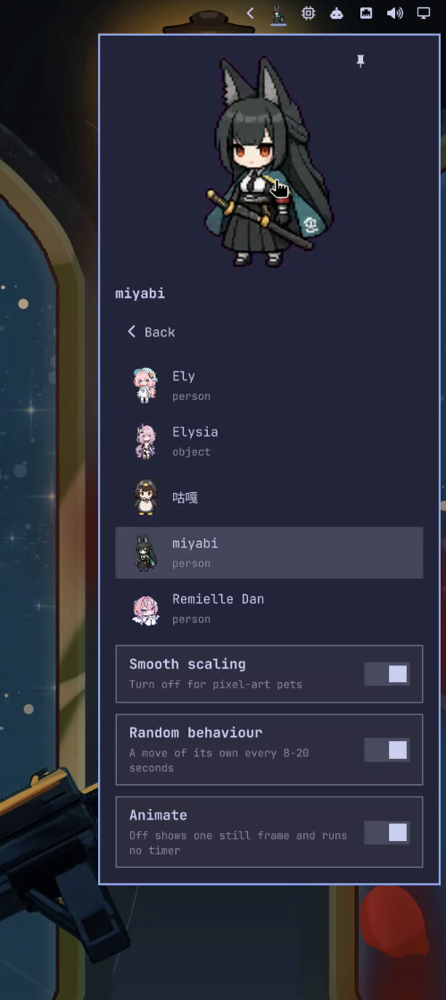

# Omarchy Pets

A desktop pet for the [Omarchy](https://omarchy.org) bar. It plays
[Codex Pets](https://codex-pets.net) sprite sheets straight from
`~/.codex/pets/`, moves on its own every 8–20 seconds, turns its head toward
your pointer, waves when clicked, and can be pinned to the desktop.



## Install

```sh
omarchy plugin add https://github.com/ZacharyZhang-NY/omarchy-pets.git --enable
```

Then download a pet from <https://codex-pets.net> and unzip it into
`~/.codex/pets/<id>/` (the same place Codex itself reads). The bar shows the
current pet's first frame; with no pets it shows a paw.

Needs `jq` and ImageMagick's `identify`, both part of the Omarchy base install.

## Use

- Click the pet in the bar to open the panel: the animated pet, the list of
  installed pets, and the settings. Escape or a click outside closes it.
- Click a pet in the list to switch. The choice survives shell restarts.
- Hover the pet and it looks at the pointer (v2 sheets only); click it and it
  waves.
- The pin button (top-right of the pet) keeps the pet on the desktop with the
  panel closed. It never takes keyboard focus and only the pet itself is
  clickable. Click the pin again, or the bar icon, to unpin.

## Settings

All of them live in the widget's entry in `~/.config/omarchy/shell.json` and
can be set from the CLI:

```sh
omarchy bar set raiden-meixelysia.omarchy-pets smooth false --json
```

| Key | Type | Default | Meaning |
|---|---|---|---|
| `petId` | string | `""` | Directory name of the current pet; empty means the first one |
| `petsDir` | string | `~/.codex/pets` | Where pets are read from |
| `smooth` | bool | `true` | Bilinear scaling; turn off for pixel-art pets |
| `pinned` | bool | `false` | Keep the pet on the desktop |
| `randomBehavior` | bool | `true` | Play a random move every 8–20 s |
| `animate` | bool | `true` | Off shows one still frame and runs no timer |

## Remove

```sh
omarchy plugin remove raiden-meixelysia.omarchy-pets
```

## Develop

```sh
omarchy plugin validate .
/usr/lib/qt6/bin/qmllint -I "$OMARCHY_PATH/shell" *.qml
/usr/lib/qt6/bin/qmltestrunner -input test
```

The plugin runs inside `omarchy-shell`; after changing files under
`~/.config/omarchy/plugins/`, restart the shell (`omarchy restart shell`) and
check `journalctl --user | grep omarchy-pets`.

## Credits

Sprite format from [Codex Pets](https://codex-pets.net); frame timing from
[Petdex](https://github.com/crafter-station/petdex) (MIT). Pet assets are
third-party uploads with unclear licences and are not part of this repository.

## License

MIT — see [LICENSE](LICENSE).
